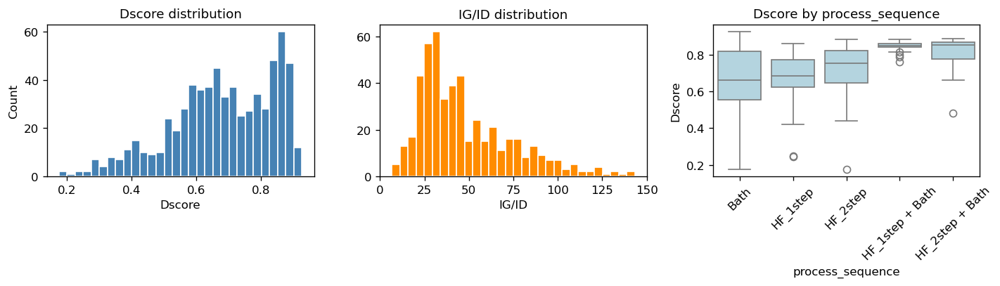
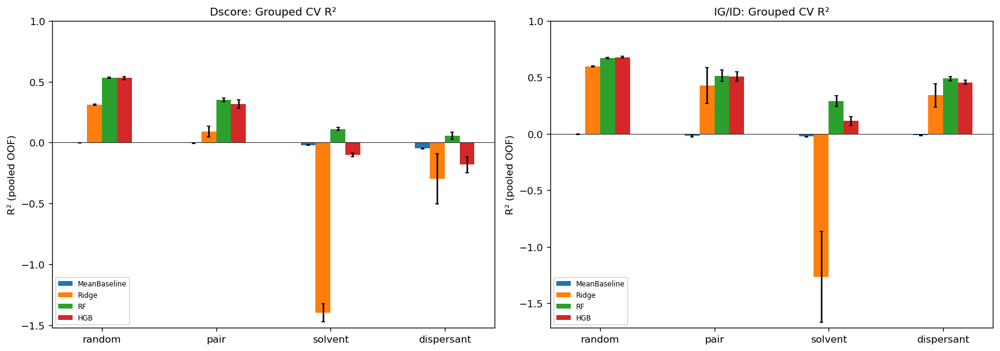
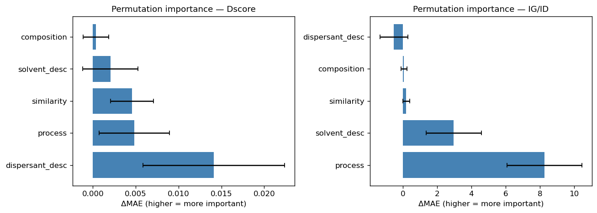
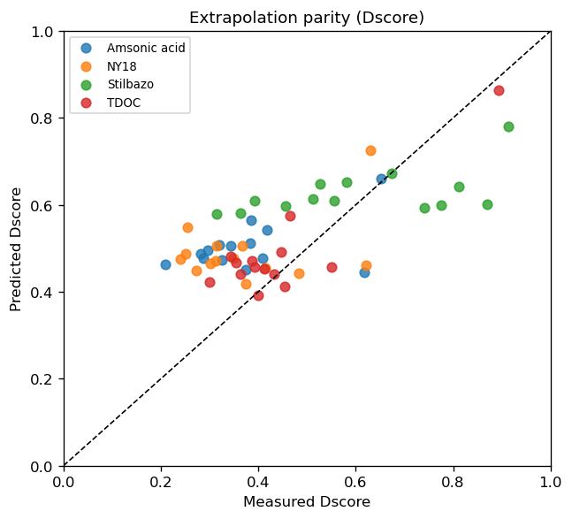
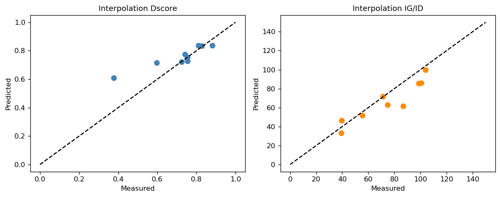
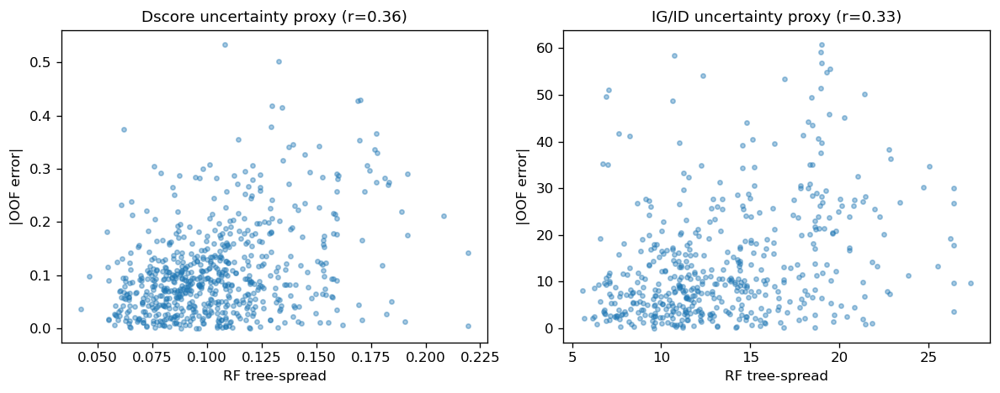
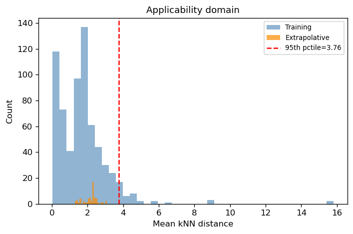
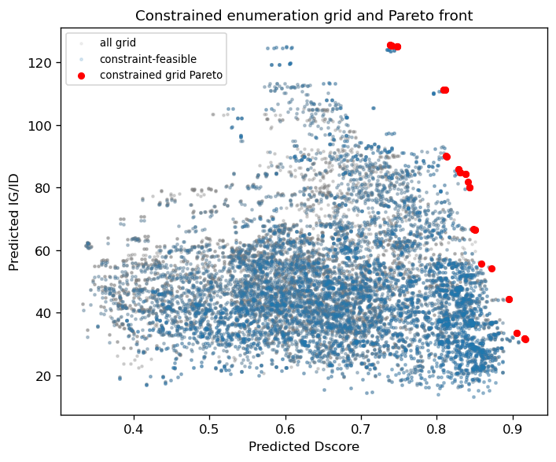
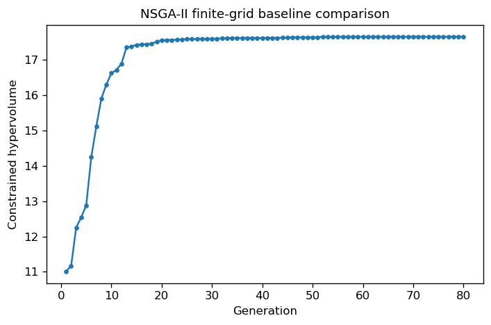

# CNT Dispersion Materials Informatics — NSGA-II Multi-Objective Screening

A materials-informatics workflow for **carbon nanotube (CNT) dispersion screening** under limited experimental data. The project combines molecular descriptors, formulation/process variables, tree-based regression, chemical generalization tests, applicability-domain screening, and constrained **NSGA-II** optimization.

> **Scope:** Surrogate-model screening and hypothesis generation. Pareto candidates require experimental validation. RME and sonication are treated as **data-derived process descriptors**, not directly executable machine settings.

## Objectives

- **Dscore** — microscopy-derived dispersion quality (higher is better).
- **IG/ID** — Raman-based structural/crystallinity index (higher is better).
- **NSGA-II** — explores the trade-off between dispersion quality and structural preservation.

## Dataset & Workflow

**Dataset:** 669 training rows; 666 usable Dscore measurements; 496 usable IG/ID measurements; 36 dispersants; 22 solvents; 2 CNT types; 289 observed dispersant–solvent pairs; 347 observed chemistry–process designs. External validation contains 56 extrapolative and 9 interpolation cases.

```text
Experimental data
      ↓
Cleaning & feature engineering
      ↓
Molecular + formulation + process descriptors
      ↓
EDA & target analysis
      ↓
RF / HGB regression modelling
      ↓
Grouped validation + applicability-domain screening
      ↓
Constrained NSGA-II multi-objective optimization
      ↓
Pareto candidate generation
      ↓
Experimental validation / iterative refinement
```

### Model / Optimization specification

- RF + HistGradientBoosting ensemble for the final surrogate predictions.
- Fold-safe imputation, low-variance filtering, and one-hot categorical encoding.
- **3-seed grouped CV:** random, pair, solvent, and dispersant hold-outs.
- **Applicability domain:** standardized kNN distance.
- **Uncertainty diagnostic:** RF tree-prediction spread as a model-disagreement proxy.
- **NSGA-II:** 6 decision variables — observed chemistry–process design, CNT type, wt%, dispersant/CNT ratio, RME, and sonication.
- **Optimization:** 100 individuals × 80 generations with 3 active constraints.
- CNT type is optimized independently, so some generated CNT–chemistry combinations represent **controlled extrapolation**.

## Key Results

| Evaluation | Dscore | IG/ID |
|---|---:|---:|
| Random CV R² (RF) | **0.533 ± 0.005** | **0.674 ± 0.006** |
| Pair hold-out R² | 0.351 ± 0.013 | 0.515 ± 0.052 |
| Solvent hold-out R² | 0.111 ± 0.011 | 0.291 ± 0.049 |
| Dispersant hold-out R² | 0.056 ± 0.031 | 0.489 ± 0.021 |
| Interpolation R² | **0.602** | **0.754** |
| Extrapolation R² (4 unseen dispersants) | **0.253** | **−0.278** |

Paper `Predicted*` columns are also reproduced: **Dscore R² = 0.566, MAE = 0.078** and **IG/ID R² = 0.728, MAE = 9.837**.

### NSGA-II screening output

- **36,640** finite-grid candidates evaluated.
- **9,687 (26.4%)** satisfy all AD / RF-spread constraints.
- **35** constrained finite-grid Pareto designs.
- **92** feasible unique NSGA-II Pareto formulations after deduplication.
- Predicted Pareto ranges: **Dscore 0.717–0.905**; **IG/ID 33.5–126.0**.
- Finite-grid vs NSGA-II hypervolume ratio: **1.059×** (reference comparison, not an accuracy score).

## Key Figures

### Target distributions


### Grouped chemical generalization


### Feature-group permutation importance


### External extrapolation


### Interpolation validation


### RF spread vs prediction error


### Applicability domain


### Constrained Pareto search


### NSGA-II convergence


## Limitations

- Pareto candidates are **predictions, not measurements**.
- Independent CNT selection can create controlled extrapolative combinations.
- kNN distance and RF spread are screening diagnostics, **not calibrated probabilities**.
- IG/ID has fewer observations because some Raman spectra are unavailable.
- Dscore measures short-term optical dispersion uniformity, not long-term stability.
- Missing machine-level controls limit direct conversion of RME/sonication descriptors into equipment settings.

## Reproduction

Run the notebook with the supplied training/validation CSV files and the project dependencies listed in `requirements.txt`.

**Main notebook:** `cnt_dispersion_audit_optimizer_corrected_final(3).ipynb`

**Typical outputs:** `figures/`, `pareto_candidates_corrected.csv`, `nsga2_hypotheses_to_test.csv`

## References

1. H. Jintoku, “Machine-Learning-Based Dispersion Optimizer for Carbon Nanotubes across Dispersant–Solvent–Process Space,” *ACS Applied Materials & Interfaces* **2026**, 18, 22287–22299. DOI: https://doi.org/10.1021/acsami.6c01563
2. J. Blank, K. Deb, “pymoo: Multi-Objective Optimization in Python,” *IEEE Access* **2020**. DOI: https://doi.org/10.1109/ACCESS.2020.3038251
3. F. Pedregosa et al., “Scikit-learn: Machine Learning in Python,” *JMLR* **2011**, 12, 2825–2830.
4. S. M. Lundberg, S.-I. Lee, “A Unified Approach to Interpreting Model Predictions,” *NeurIPS* **2017**.
5. RDKit: Open-source cheminformatics software. https://www.rdkit.org/

## Tools

**Python · NumPy · pandas · scikit-learn · RDKit · Matplotlib · Seaborn · SHAP · pymoo · XGBoost/LightGBM (benchmark support)**

**Project status:** Research / portfolio prototype for materials-informatics screening.
